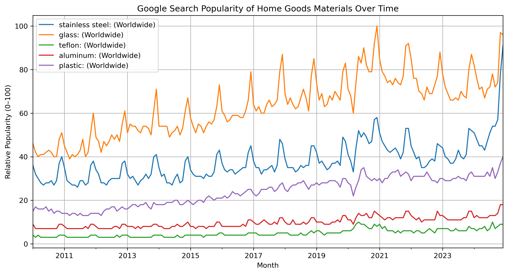
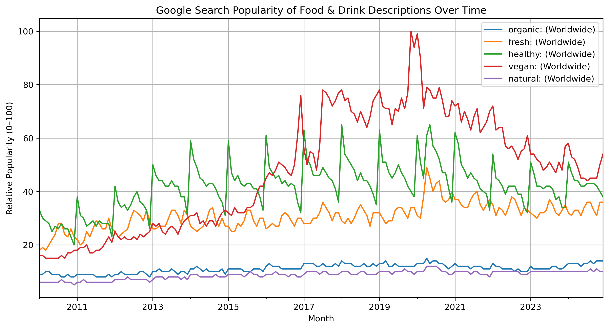

## Forecasting Consumer Interest in Eco-Friendly Products

In this project I use Google Trends and Facebook's Prophet model to analyze and forecast consumer interest in the following categories:

- Natural fabrics in Shopping > Apparel
- Non-toxic materials in Home & Garden > Kitchen & Dining
- Healthy descripions in Food & Drink

**Google Trends** allows users to visualize how often specific terms are entered into Google's search engine over time. It helps analyze public interest and identify emerging trends by plotting the relative popularity of search queries which can be filtered based on different categories, by regions and/or time periods. Users can compare up to five search terms in a single query, and the results are normalized on a relative scale from 0 to 100, where 100 represents the peak popularity of a term. 

**Facebook Prophet** is an open-source forecasting model designed for time-series data. It works by decomposing time series as a sum of three components: trend, seasonability and holiday effects. The model fits piecewise linear or logistic trends, captures seasonal patterns using a Fourier series, and uses indicator functions for customizable holiday events causing spikes or dips. To evaluate forecasting accuracy, Prophet supports rolling forward cross-validation where the model is repeatedly trained on an expanding window of historical data and then used to forecast a fixed horizon into the future.

The Google Trends data in this project spans the years 2010-2024. We begin by plotting the data, we then use Prophet to fit the data and create a model to forecast one year into the future. 

#### Natural Fabrics Trends

#### Prophet's Output

The following plot is the fitted time series (2010 - 2024) which includes the one-year forecast by extending the time series to the end of 2025/ beginning of 2026.

We can also break down the model results into its trend and seasonality components. We do this for the first item in the Natural Fabrics category. That is, in the following figure we show the model output of "cotton" and it's trend component as well as it's yearly seasonality trend. 

Visualy, the model output seems to match the data pretty well, which gives confidence in the forecast. But for educational purposes, we produce error estimates for the model output using its built-in **cross validation** tool.

#### Prophet's cross validation

Prophet’s cross_validation() function evaluates forecast accuracy using a **rolling forecast** approach. You can specify three key parameters: the initial training period, the forecast horizon, and the spacing between cutoff dates (called the period).

The model is first trained on the **initial** window of data, and a forecast is made for the specified **horizon**. For example, if the initial period is 2 years and the horizon is 1 year, Prophet trains on 2 years of data and forecasts the next year. Then, the training window is extended by the specified **period** (e.g. 6 months), and the process repeats: Prophet retrains on 2 years and 6 months worth of data and again forecasts 1 year ahead. In the next iteration, Prophet trains on 3 years of data and forecasts 1 year ahead, and so on. This rolling process continues until the end of the dataset is reached. The result is multiple simulated forecasts or time series up to period-increasing cutoff points.

We take the forecast of "cotton" search popularity and perform cross validation with the values 
- initial = 730 days # (2 years)
- period = 180 days  # (6 months)
- horizon = 365 days # (1 year)

Then using Prophet's diagnostics module we produce a table of error metrics for each horizon forecast.    

For each horizon month, we list the MAPE (Mean Absolute Percent Error), the RMSE (Root Mean Square Error) and the coverage. 
The MAPE measures the average percentage difference between the predicted values and the actual values. Here we see that the MAPE range is between about 4-6%. The model also achieves an RMSE of 3–5 units on a 0–100 popularity scale, indicating that forecast errors typically fall within 3–5% of the total range. 
The coverage column gives the proportion of actual values (y) that fall within the forecast uncertainty interval. The observed coverage ranged between 30% and 50%, indicating that only a small portion of the actual values fell within the model's predicted intervals. However, according to Prophet's documentation, the model detects and fits trend changes in the historical data, and *assumes* similar trend changes in the future. That is, Prophet assumes that the average frequency and magnitude of trend changes in the future will be the same as that observed in the history. By projecting trend changes forward and computing their distribution, uncertainty intervals are obtained. But because this assumption is probably not true, accurate coverage on the uncertainty intervals should not be expected. 

------------------------------------------------------------------------------------------------------------------------------------

We do not conduct in-depth analysis on time-series components or error analysis for the other items in the category. Instead, we simply plot the time-series data and the modeled forecast for the remaining categories. 

#### Trend and Forecast Home Goods Materials   
  

    

#### Trend and Forecast Food & Drink Descriptions   

    

   
